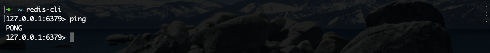
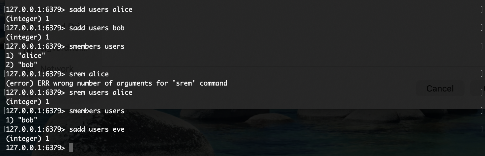
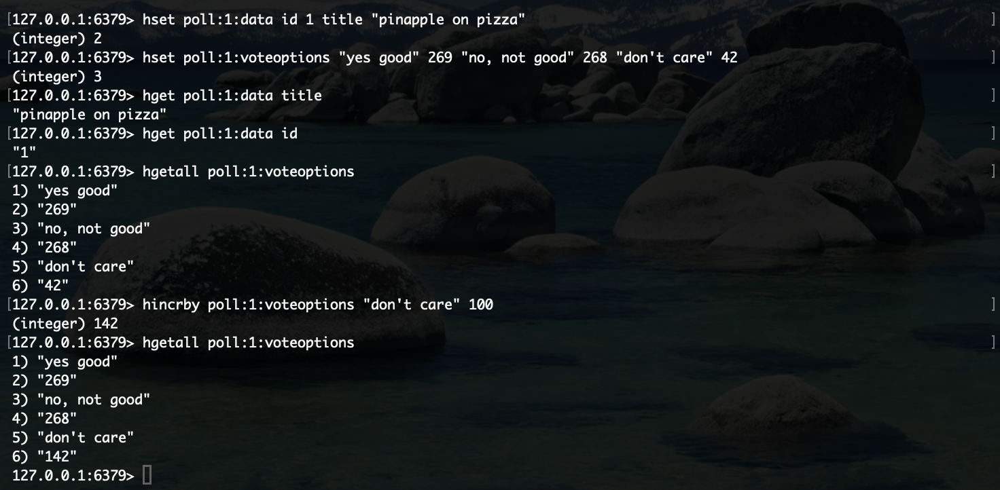

#### Redis 
Task 1 and two was completed with the hashmap and set functions in redis. 
The following images are the installation of redis as well as the solution to task 1 and 2 in the commandline.
The only issue i had with the installation was that i did not know that we needed to "redis-server", to start the actual server.

Followed the same steps as in the terminal using jedis; this is literally just dont in the [main](src/main/java/com/example/dat250_1/dat2501Application.java) java file :').

The cache implementation was done using the already structured [PollManager](src/main/java/com/example/dat250_1/controller/PollManager.java)
The REST endpoint takes a pollId and returns the map of caption and votes. 
First, I check if the poll given already is cached, if so, we can return the contents immediately. 
If not, we need to get the votes from the database, and I basically go through the voteoptions stored to create a new map. Thereafter, we store these values into a hashmap in redis and set the ttl for the cached poll.
Whenever we delete a poll, we also delete it from the cache. 
I implemented a get request in the http client.
After running all the tests, meaning there is data stored in the database, we also get the following result from the get request.
